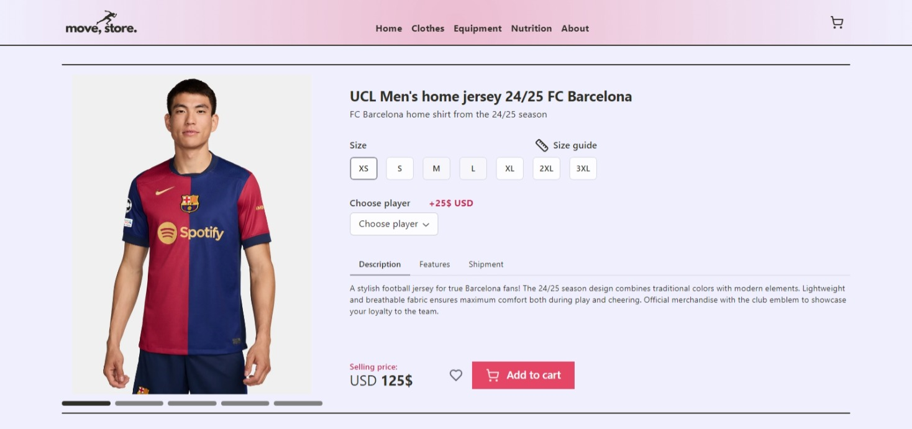

# Store page

This is a product page for the Barcelona football jersey, implemented in React

## 🏃‍♂️ Running the Project

You can view the assembled website: [store-page-theta.vercel.app](https://store-page-theta.vercel.app/)

1. Clone the repository to your local machine.
2. Run `npm install` or `yarn` in the project directory to install the required dependencies.
3. Run `npm run dev` or `yarn dev` to get the project started.

## 📦 Technologies

- `Java Script`
- `React`
- `Vite`
- `Radix UI`
- `HTML & CSS`

## 🪓 Features & Process

**Auto/Manual slider**: The image slider was developed without the use of third-party libraries. It has two modes: automatic and manual. The automatic mode switches images every 5 seconds, and when you hover over an image, the mode is switched off. The manual mode allows you to switch images using the mouse wheel/swipe or by interacting with the indicator.

**Radix UI**: This library is used for the product description block, which is implemented with it: radio button cards, select, tabs, buttons, popover. 

**UI**: The interface is designed in a minimalist style for maximum ease of use. There is a product page with an image. There is also a product description block, where you can select options such as the size of the shirt, as well as the player's name on the shirt, add the product to your favourites, and add the product to the cart.

**Adaptive Design**: The website is fully adaptive, ensuring that it is responsive and optimized for viewing on all devices, from desktops to tablets and smartphones.

## ⭐ Sources of inspiration

- [behance.net](https://www.behance.net/gallery/30906667/INSELLER-Online-Luxury-Shop?tracking_source=search_projects_appreciations%7Cecommerce)
- [behance.net](https://www.behance.net/gallery/31550607/Stylovky)
- [behance.net](https://www.behance.net/gallery/116365517/GUBI-Website)
- [behance.net](https://www.behance.net/gallery/196882855/SHOPIFY-STORE-ECOMMERCE-ONLINE-SHOP?tracking_source=search_projects%7C+store+design)
- [dribbble.com](https://dribbble.com/shots/4440700-Braun-Watches-redesign)
- [dribbble.com](https://dribbble.com/shots/2249630-Watch-Product-Card?1442498055)
- [dribbble.com](https://dribbble.com/shots/2263921-Brilliant-Bicycle-Product-Page/attachments/424385)
- [dribbble.com](https://dribbble.com/shots/2789253-Grenz-Vergleich-web-layouts/attachments/570261)
- [dribbble.com](https://dribbble.com/shots/7047538-Minimal-Furniture-detail-page-Web-Mobile)
- [dribbble.com](https://dribbble.com/shots/4440700-Braun-Watches-redesign)
- [dribbble.com](https://dribbble.com/shots/4440700-Braun-Watches-redesign)

## 😍 Performance

